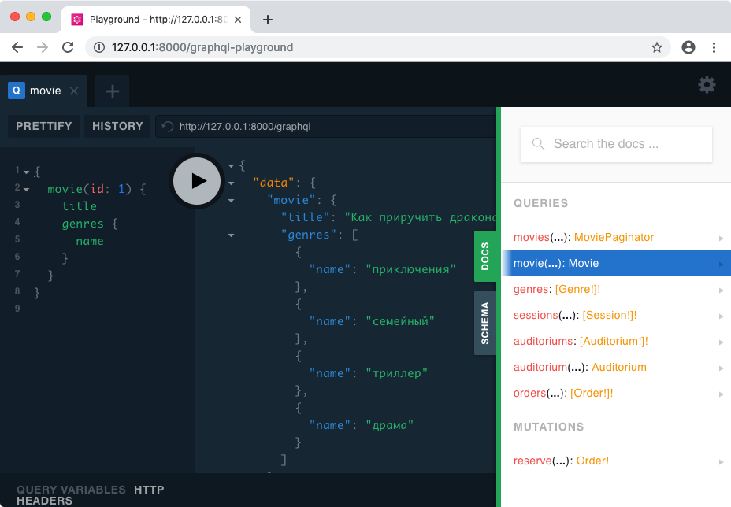

GraphQL API для тестового задания на Middle Frontend Developer.
---

#### Требования к окружению
1. PHP >= 7.2
2. Composer https://getcomposer.org/download/
3. MySQL / PostgreSQL

#### Настройка
1. Устанавливаем зависимости:
    ```bash
    composer install
    ```
2. Настраиваем ENV переменные:
    ```bash
    cp .env.example .env
    ```
    В скопированном файле меняем настройки подключения к базе данных, заранее ее создав.
    
3. Запускаем миграцию БД:
    ```bash
   php artisan migrate
   ```
4. Заполняем БД тестовыми данными:
    ```bash
    php artisan db:seed
    ```
    
На этом настройка завершена. Для запуска проекта вводим `php artisan serve`.

Entry point для GraphQL API находится на `/graphql`.

Для просмотра схемы и отладки запросов можно полозоваться установленной песочницей:



#### Сброс данных
Если потребуется сброс данных в БД,
откатываем миграцию, накатываем заново и снова заливаем тестовые данные:

```bash
    php artisan migrate:rollback && \
    php artisan migrate &&
    php artisan db:seed
```

### Описание сущностей
Доп информацию можно узнать из схемы.
<table>
    <tr><td>movie</td><td>фильм</td></tr>
    <tr><td>genre</td><td>жанр фильма</td></tr>
    <tr><td>auditorium</td><td>кинозал</td></tr>
    <tr><td>seat</td><td>место в кинозале</td></tr>
    <tr><td>session</td><td>киносеанс</td></tr>
    <tr><td>order</td><td>бронь</td></tr>
</table>
